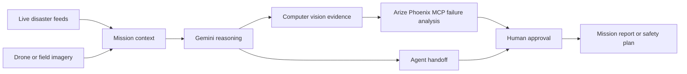
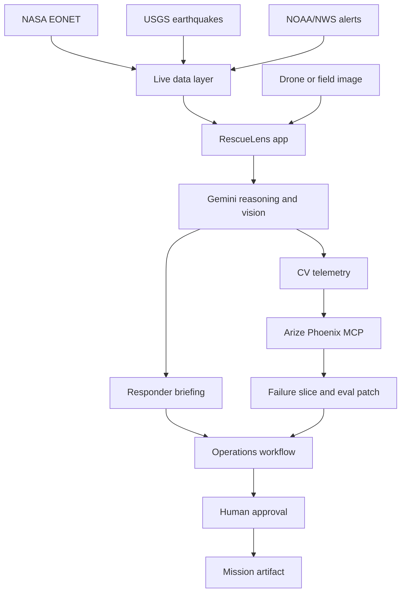

# RescueLens

**RescueLens is a supervised disaster-response agent that helps response teams turn live disaster alerts, map context, and drone or field imagery into human-reviewed rescue decisions.**

It combines live public incident feeds, Gemini-powered mission reasoning, computer vision evidence, Arize Phoenix MCP failure analysis, and a human approval workflow so responders can inspect model risk before acting.

Hosted app:

```txt
https://rescuelens-886752717262.us-central1.run.app
```

## Why RescueLens Exists

During a disaster, response teams are surrounded by signals:

- earthquake reports
- wildfire and flood alerts
- weather warnings
- drone or field images
- blocked roads
- damaged infrastructure
- uncertain AI predictions

The challenge is not only collecting this information. The challenge is deciding what is safe enough to do next.

RescueLens is designed for that moment. It helps responders move from scattered evidence to a structured mission plan, while keeping human review at the center.

## What RescueLens Does

RescueLens helps a response team:

1. View live public disaster events from sources such as NASA EONET, USGS, and NOAA/NWS.
2. Search for a location and inspect nearby incidents.
3. Select an incident as the mission context.
4. Attach drone or field imagery to the mission.
5. Analyze visual evidence for hazards, route risk, damage, blocked roads, and possible life-safety signals.
6. Display heatmaps, object detections, segmentation regions, and road-safety findings.
7. Generate responder briefings, safety plans, dispatch tasks, route recommendations, and mission reports.
8. Use observability and failure-analysis signals to highlight model risk.
9. Keep final action behind a human approval step.

RescueLens is not intended to replace emergency professionals. It is a decision-support system that makes evidence, reasoning, and uncertainty easier to inspect.

## Product Flow



## Core Features

### Live Incident Context

RescueLens uses public incident data to give the agent real mission context instead of starting from an empty prompt. A user can search a location, inspect nearby events, and choose the incident that should guide the mission.

### Vision Evidence Review

Drone or field imagery can be attached to the mission. The system analyzes hazards, damaged areas, possible blocked roads, and life-safety signals.

The interface shows visual overlays so users can inspect the evidence directly:

- heatmaps
- object detections
- segmentation regions
- road-safety findings
- field intelligence
- responder briefing

### Gemini Mission Reasoning

Gemini turns the selected incident, visual evidence, route context, and current mission state into a structured response plan.

The agent can prepare:

- responder briefings
- dispatch tasks
- route-closure recommendations
- safety plans
- evaluation summaries
- mission reports

These actions are treated as recommendations, not automatic commands. A human reviewer remains responsible for approval.

### Arize Phoenix MCP Failure Analysis

RescueLens includes a failure-analysis workflow for computer vision outputs. This helps surface cases where the model may be less reliable, such as:

- low light
- floodwater glare
- smoke
- occlusion
- ambiguous road damage
- small or partially hidden objects
- similar-looking hazard patterns

The goal is not only to produce an answer, but to show when that answer may be risky.

Example failure slice:

```txt
low_light_water_glare
```

This matters because floodwater reflection can hide road edges, trapped vehicles, debris, or people. When this risk is detected, the agent can change its recommendation from dispatch to human review, second-angle drone inspection, or route uncertainty.

### Human-Approved Operations

The operations layer turns analysis into reviewable response work. RescueLens can generate operational artifacts, but the final action remains behind a human approval gate.

This keeps the system useful for high-pressure decisions without pretending that AI should independently control emergency response.

## Runtime Integrations

| System | Purpose |
| --- | --- |
| Gemini | Mission reasoning, image analysis, responder briefing generation |
| Google Agent Platform / Agent Builder | Managed-agent handoff and interaction flow |
| Arize Phoenix MCP | Failure analysis and observability workflow |
| Arize-style CV telemetry | Classification, detection, segmentation, embeddings, drift, monitors, and evaluators |
| Cloud Run | Hosted deployment |
| Live public feeds | NASA EONET, USGS, NOAA/NWS incident context |

## Demo Flow

1. Open the hosted RescueLens app.
2. Review the Mission section.
3. Search for a location or inspect live public incidents.
4. Select an incident as the mission context.
5. Attach or inspect drone evidence.
6. Review visual overlays and safety-road analysis.
7. Run the agent workflow.
8. Review the Arize failure-analysis loop.
9. Check the runtime integrations panel.
10. Open the generated mission report or safety plan.
11. Approve, reject, or revise the recommended action.

## Architecture



## Project Structure

```txt
server.js                           Node server and API routes
src/geminiClient.js                 Gemini vision, command planning, TTS
src/agentBuilderClient.js           Google Agent Platform / Agent Builder client
src/arizeMcpClient.js               Phoenix MCP stdio/http client
src/arizeCv.js                      Arize-style CV telemetry
src/liveData.js                     NASA, USGS, NOAA/NWS live feeds
src/actionStore.js                  Mission reports, dispatch tasks, route closures
src/integrationStatus.js            Runtime integration status
src/runtimeVerification.js          Runtime verification checks
public/                             Frontend dashboard
mcp/phoenix-mcp.config.json         Phoenix MCP config
agent-builder/rescuelens-agent.yaml Agent Platform / Agent Builder spec
docs/                               Project docs, architecture, and demo materials
```

## Local Setup

Requirements:

- Node.js 20+
- Google Gemini API key
- Google Cloud project access
- Arize/Phoenix credentials if running the full observability workflow

Install dependencies:

```bash
npm install
```

Start the app:

```bash
npm run dev
```

Open:

```txt
http://localhost:3000
```

Create `.env` from `.env.example` and set the required values:

```bash
GEMINI_API_KEY=
GEMINI_MODEL=
GEMINI_AGENT_MODEL=
GEMINI_FALLBACK_MODEL=

GOOGLE_CLOUD_PROJECT=
GOOGLE_CLOUD_REGION=
AGENT_BUILDER_LOCATION=
AGENT_BUILDER_TIMEOUT_MS=
GOOGLE_CLOUD_ACCESS_TOKEN=

PHOENIX_BASE_URL=
PHOENIX_API_KEY=
ARIZE_API_KEY=
ARIZE_SPACE_ID=
ARIZE_MCP_TIMEOUT_MS=
```

Do not commit `.env`.

## Cloud Run Deployment

The app is designed to run on Cloud Run with `PORT=8080`.

Example deployment:

```bash
gcloud run deploy rescuelens \
  --source . \
  --project YOUR_PROJECT_ID \
  --region us-central1 \
  --allow-unauthenticated
```

For hosted deployment, use Secret Manager for API keys and metadata auth for Google Cloud calls where possible.

## Safety Notice

RescueLens is a prototype decision-support system. It is not an autonomous emergency authority.

Any real deployment must follow local emergency protocols, validate model outputs against trusted sources, and keep trained responders in control of dispatch, evacuation, and route-closure decisions.

## License

Apache-2.0
