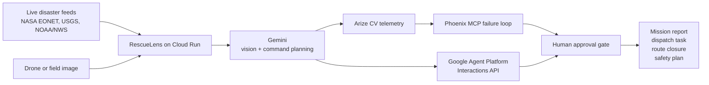

# RescueLens

**A supervised disaster-response agent that turns live public disaster signals and drone imagery into human-approved rescue actions.**

RescueLens was built for the Google Cloud Rapid Agent Hackathon in the **Arize track**. It is not a chatbot. It is an action-oriented agent workflow: it finds a live incident, inspects drone or field imagery, asks Gemini to reason over the mission, uses Arize Phoenix MCP and Arize computer vision observability to check failure risk, calls Google Agent Platform for a managed-agent handoff, and creates response artifacts for human approval.

Hosted demo:

```text
https://rescuelens-886752717262.us-central1.run.app
```

Judge path: open the hosted app and click **Run judge demo**.

Hosted readiness verified on June 11, 2026:

```text
requiredLiveReady: true
prizeReady: true
Gemini: pass
Google Agent Platform: pass
Arize Phoenix MCP: pass
Arize CV: pass
Live feeds: pass
```


## Why It Matters

During floods, wildfires, earthquakes, and severe weather events, responders face too many signals at once:

- live alerts from multiple agencies
- satellite context
- drone or field images
- uncertain computer vision outputs
- pressure to dispatch quickly

The dangerous gap is the moment between **seeing evidence** and **acting on it**. RescueLens makes that handoff explicit. The agent can recommend a route closure, dispatch task, safety plan, or mission report, but every operational artifact remains gated by human approval.

## What The Agent Does

1. Pulls real public disaster feeds from NASA EONET, USGS, and NOAA/NWS.
2. Lets the user search locations and select the nearest live incident.
3. Analyzes uploaded drone or field images with Gemini.
4. Shows heatmaps, object detections, segmentation regions, and safety-road calculations.
5. Emits Arize-shaped CV telemetry for classification, object detection, semantic segmentation, instance segmentation, embeddings, drift, monitors, and evaluators.
6. Calls Arize Phoenix MCP to inspect prompts, datasets, experiments, and failure slices.
7. Calls Google Agent Platform / Agent Builder Interactions API for a managed-agent handoff.
8. Creates human-approved mission artifacts: reports, route closures, dispatch tasks, safety plans, and eval reports.

## Required Technology Proof

RescueLens invokes the required hackathon technologies at runtime:

| Requirement | Runtime Proof |
| --- | --- |
| Gemini | `/api/agent-command`, `/api/analyze-upload`, `/api/tts` |
| Google Cloud Agent Builder / Agent Platform | `/api/agent-builder/invoke` calls the live Interactions API |
| Arize MCP | `/api/arize/failure-analysis` starts `@arizeai/phoenix-mcp` over stdio |
| Arize computer vision | `/api/arize/cv-observability` emits CV telemetry for detection, segmentation, embeddings, drift, monitors, and evals |
| Hosted app | Cloud Run public URL |

The hosted app exposes a readiness endpoint:

```bash
curl -X POST https://rescuelens-886752717262.us-central1.run.app/api/submission-readiness/live-check
```

Expected result:

```json
{
  "requiredLiveReady": true,
  "prizeReady": true
}
```

## Architecture



More diagrams:

- [Architecture and flow](docs/ARCHITECTURE_FLOW.md)
- [Architecture SVG](docs/assets/rescuelens-architecture.svg)

## Demo Script

Use this flow for judging:

1. Open the hosted app.
2. Show live incident feed and location search.
3. Select or inspect a live incident.
4. Show the drone evidence panel, heatmap, detections, and safety-road analysis.
5. Click **Run judge demo**.
6. Show the Runtime integrations panel:
   - Gemini called
   - Google Agent Platform live interaction submitted
   - Arize Phoenix MCP connected through stdio
   - Prize readiness passed
7. Open the generated mission report or safety plan artifact.

Submission assets:

- [Pitch presentation](docs/PITCH_PRESENTATION.md)
- [Video transcript](docs/VIDEO_TRANSCRIPT.md)
- [Architecture flow](docs/ARCHITECTURE_FLOW.md)
- [Submission checklist](docs/SUBMISSION_CHECKLIST.md)

## Arize Track Fit

Arize is not a badge in this project; it is the reliability layer.

RescueLens maps the disaster-response workflow onto Arize computer vision concepts:

- **Image classification:** scene and urgency labels.
- **Object detection:** people, vehicles, roads, bridges, debris, smoke, landing zones.
- **Semantic segmentation:** floodwater, smoke, unsafe bridge edge, road washout.
- **Instance segmentation:** object-level masks for detected hazards.
- **Embeddings:** image vectors for visual similarity and drift clusters.
- **Monitors and evaluators:** false-negative risk, recall, calibration, drift, and human-review thresholds.
- **Phoenix MCP:** prompt, dataset, experiment, and failure-slice discovery.

The highlighted failure slice is `low_light_water_glare`, where small-object recall can fail during flood response.

See [Arize CV mapping](docs/ARIZE_CV_MAPPING.md).

## Local Setup

Requirements:

- Node.js 20+
- Google Gemini API key
- Phoenix/Arize credentials for live MCP/CV proof
- Google Cloud project and auth for Agent Platform calls

Install/run:

```bash
npm run dev
```

Open:

```text
http://localhost:3000
```

Create `.env` from `.env.example` and set:

```bash
GEMINI_API_KEY=
GEMINI_MODEL=gemini-3.5-flash
GEMINI_AGENT_MODEL=gemini-3.5-flash
GEMINI_FALLBACK_MODEL=gemini-2.5-flash

GOOGLE_CLOUD_PROJECT=
GOOGLE_CLOUD_REGION=us-central1
AGENT_BUILDER_LOCATION=global
AGENT_BUILDER_TIMEOUT_MS=30000
GOOGLE_CLOUD_ACCESS_TOKEN=

PHOENIX_BASE_URL=
PHOENIX_API_KEY=
ARIZE_API_KEY=
ARIZE_SPACE_ID=
ARIZE_MCP_TIMEOUT_MS=60000
```

For local smoke tests, get a temporary Google token:

```bash
gcloud auth login
gcloud config set project YOUR_PROJECT_ID
gcloud auth print-access-token
```

Do not commit `.env`.

## Cloud Run Deployment

The included `Dockerfile` uses `PORT=8080`, matching Cloud Run.

```bash
gcloud run deploy rescuelens \
  --source . \
  --project YOUR_PROJECT_ID \
  --region us-central1 \
  --allow-unauthenticated
```

For hosted deployment, use Secret Manager for API keys and metadata auth for Agent Platform:

```bash
AGENT_BUILDER_USE_METADATA_TOKEN=true
AGENT_BUILDER_TIMEOUT_MS=45000
ARIZE_MCP_TIMEOUT_MS=60000
```

See [hosted live setup](docs/HOSTED_LIVE_SETUP.md).

## Project Structure

```text
server.js                         Node server and API routes
src/geminiClient.js               Gemini vision, command planning, TTS
src/agentBuilderClient.js         Google Agent Platform Interactions API
src/arizeMcpClient.js             Phoenix MCP stdio/http client
src/arizeCv.js                    Arize-shaped CV telemetry
src/liveData.js                   NASA, USGS, NOAA/NWS live feeds
src/actionStore.js                Reports, dispatch tasks, route closures
public/                           Frontend dashboard
mcp/phoenix-mcp.config.json       Phoenix MCP config
agent-builder/rescuelens-agent.yaml Agent Platform/Agent Builder spec
docs/                             Submission, pitch, architecture docs
```

## Safety

RescueLens is a decision-support prototype. Real disaster-response deployments must validate detections against ground truth, follow local emergency protocols, and keep trained responders in control of dispatch, evacuation, and route-closure actions.

## License

Apache-2.0

