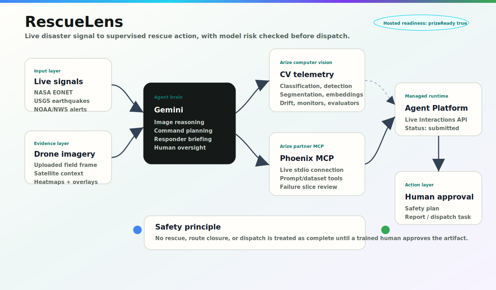
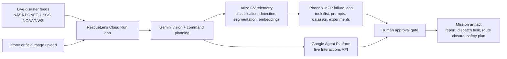
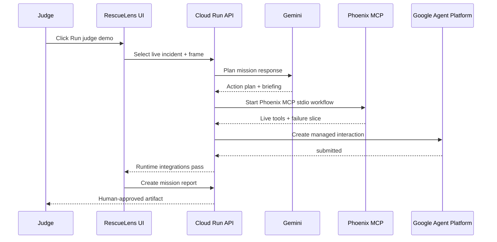

# RescueLens Architecture And Flow

Hosted app:

```text
https://rescuelens-886752717262.us-central1.run.app
```

Hosted readiness verified on June 11, 2026:

```text
requiredLiveReady: true
prizeReady: true
Gemini: pass
Agent Builder live: pass
Arize MCP live: pass
Arize CV: pass
Live feeds: pass
```

## Creative Architecture Diagram

Use this asset in the README, Devpost gallery, or pitch deck:

```text
docs/assets/rescuelens-architecture.svg
```



## System Flow



## Runtime Proof Flow



## Why This Architecture Matters

- **Cloud Run** gives judges a public URL and keeps deployment simple.
- **Gemini** reasons over images, mission context, and commands.
- **Google Agent Platform** proves the system uses a managed agent runtime, not just a local script.
- **Arize Phoenix MCP** adds partner-powered model observability and failure analysis.
- **Arize CV telemetry** maps the computer vision task to classification, object detection, segmentation, embeddings, drift, monitors, and evaluators.
- **Human approval** is the final gate before any dispatch or route closure artifact is created.

